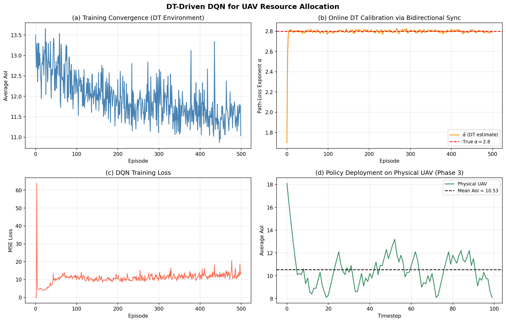

# On the Use of AI-Driven Immersive Digital Technologies for Designing and Operating UAVs

This repository contains the code and resources for the paper **"On the Use of AI-Driven Immersive Digital Technologies for Designing and Operating UAVs"** by Yousef Emami, Mohammadhossein Homaei, Miguel Gutiérrez Gaitán, Kai Li, and Sai Zou.

## Abstract
Uncrewed Aerial Vehicles (UAVs) offer agile, cost-effective and efficient solutions for communication relay networks. However, their modeling and control are challenging, and the mismatch between simulations and actual conditions limits real-world deployment, while maintaining adequate situational awareness remains essential for safe operation. Several studies have proposed integrating the operation of UAVs with immersive digital technologies such as Digital Twin (DT) and Extended Reality (XR) to overcome these challenges. This paper provides a comprehensive overview of the latest research and developments involving immersive digital technologies for UAVs. We explore the use of Machine Learning (ML) techniques, particularly Deep Reinforcement Learning (DRL), to improve the capabilities of DT for UAV systems, and present a case study of a DT-driven DRL pipeline that couples bidirectional physical-digital synchronisation with online recursive least-squares channel calibration for UAV resource allocation.

## Code Structure
- `digital_twin_driven_dqn.py`: Implementation of the DT-driven DQN model for UAV resource allocation.

## Results
The following figure illustrates the results of the Digital Twin Driven DQN model:



## Citation
If you find this code or research helpful, please cite our paper using the following BibTeX format:

```bibtex
@article{emami2024aidriven,
  title={On the Use of AI-Driven Immersive Digital Technologies for Designing and Operating UAVs},
  author={Emami, Yousef and Homaei, Mohammadhossein and Gait{\'a}n, Miguel Guti{\'e}rrez and Li, Kai and Zou, Sai},
  journal={IEEE Transactions},
  year={2024}
}
```
